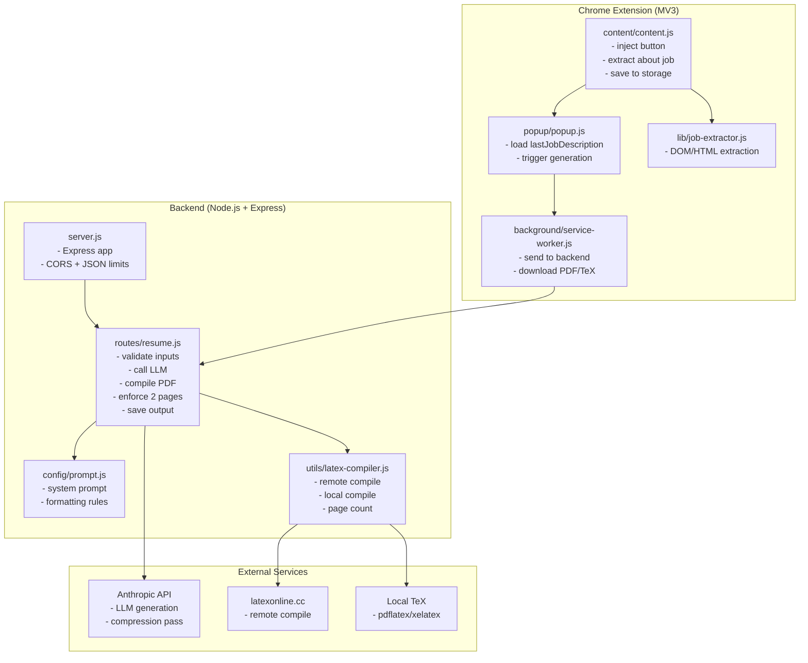
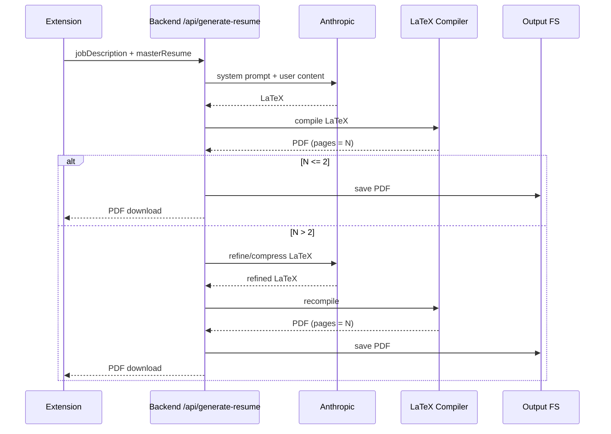
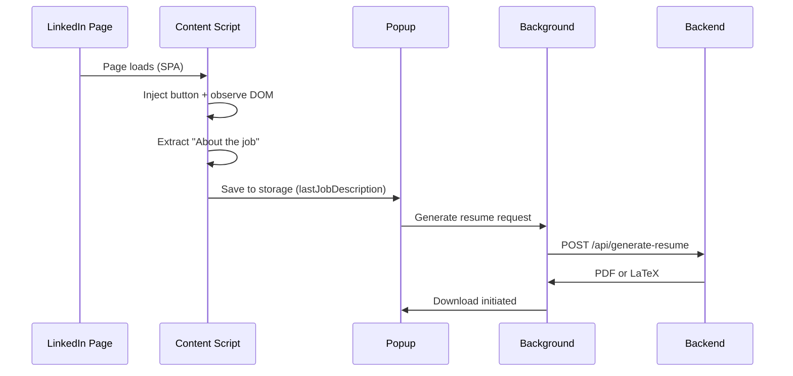
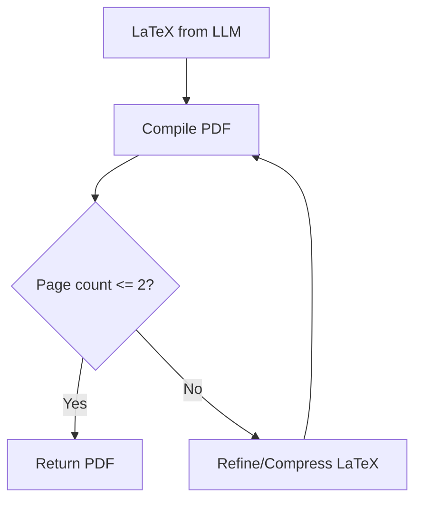

# Auto Resume Maker - Chrome Extension

AI-powered Chrome extension that generates ATS-optimized LaTeX resumes tailored to LinkedIn job postings. The system injects a button into LinkedIn job pages, extracts the “About the job” section, and uses a backend service to generate and compile a 2‑page resume PDF.

**Workspace layout**
```
/
  backend/                 Node.js API for LLM calls + LaTeX compilation
  extension/               Chrome Extension (Manifest V3)
  openrouter-agent/        Separate agent tooling (optional)
  Sample_Resume.tex        Example LaTeX resume
```

## Features
- LinkedIn page button injection for one‑click extraction.
- Robust job description extraction with multi‑selector fallbacks.
- 2‑page enforcement with post‑generation compression.
- LaTeX output compiled to PDF (remote with local fallback).
- Backend saves a copy of each generated PDF.

## Architecture

**High‑level flow**
```
LinkedIn Job Page
  └─ Content Script (button + extractor)
        └─ Extension Popup
              └─ Background Service Worker
                    └─ Backend API (Node/Express)
                          └─ Anthropic API
                                └─ LaTeX Compiler
                                      └─ PDF
```

**Mermaid diagram**


## Component Diagram (Detailed)



## Request/Response Schemas

**`POST /api/generate-resume`**

Request body:
```json
{
  "jobDescription": "string (min 50 chars)",
  "masterResume": "string (min 100 chars)"
}
```

Successful response:
```
Content-Type: application/pdf
Content-Disposition: attachment; filename="resume.pdf"
<binary PDF>
```

Fallback response when LaTeX compilation fails:
```json
{
  "success": true,
  "latex": "string",
  "compilationFailed": true,
  "error": "LaTeX compilation failed. Returning source code."
}
```

Error response:
```json
{
  "success": false,
  "error": "string"
}
```

## Internal Backend Flow (Detailed)



## Extension Details

**Core components**
- `extension/content/content.js`
  - Injects “Create Custom Resume” button.
  - Extracts “About the job” using the exact `data-sdui-component` container when present.
  - Falls back to `JobExtractor` heuristics.
  - Saves the extracted text to `chrome.storage.local` as `lastJobDescription`.
- `extension/lib/job-extractor.js`
  - Multi‑strategy extraction: heading match, LinkedIn job details, heuristic long‑text detection.
- `extension/popup/popup.js`
  - Loads `lastJobDescription` from storage.
  - Triggers resume generation via background worker.
- `extension/background/service-worker.js`
  - Sends requests to backend (preferred mode).
  - Handles PDF or `.tex` download responses.

**Popup and injection UX**


## Backend Details

**Primary endpoints**
- `GET /health` — health check
- `POST /api/generate-resume` — generate resume from job description + master resume

**Resume generation pipeline**
1. Validate job description and master resume.
2. Send combined prompt to Anthropic.
3. Extract LaTeX from response.
4. Compile LaTeX to PDF:
   - Remote `latexonline.cc` for small payloads.
   - Local `pdflatex` fallback for large payloads or when remote is disabled.
5. Enforce 2‑page limit:
   - Compile → count pages.
   - If >2 pages, refine and compress LaTeX once via Anthropic.
6. Save PDF to `backend/output/`.
7. Return PDF response to the extension.

**2‑page enforcement logic**


## Configuration

**Backend environment variables**
- `ANTHROPIC_API_KEY` (required)
- `PORT` (default `3000`)
- `LATEX_COMPILER` (`local` to force local compilation)
- `LATEX_ENGINE` (default `pdflatex`)
- `ANTHROPIC_TIMEOUT_MS` (default `120000`)

**Extension settings**
- Backend URL must be set in the extension options page.

## Prompts

### Backend system prompt (resume generation)
Source: `backend/config/prompt.js`

```
You are an expert technical recruiter and professional resume writer specializing in ATS-optimized LaTeX resumes.

**Task:**  
Generate a **custom 2-page resume in Overleaf-compatible LaTeX** using:

1. The **job description** I provide  
2. The **master resume** I provide  

You must:
- Select and reorder skills, projects, and experience to best match the job  
- Rewrite bullet points to emphasize relevance  
- Remove irrelevant content  
- Do NOT fabricate experience  
- Keep the resume **exactly 2 pages**  
- Maintain clean alignment and spacing  
- Output **ONLY LaTeX code** (no explanations)

---

## MANDATORY LaTeX Template (USE THIS EXACT PREAMBLE)
\documentclass[10.5pt,letterpaper]{article}

% Packages
\usepackage[left=0.45in,right=0.45in,top=0.4in,bottom=0.4in]{geometry}
\usepackage{enumitem}
\usepackage{hyperref}
\usepackage{titlesec}
\usepackage{fontawesome5}
\usepackage{xcolor}
\usepackage{multicol}

% Colors
\definecolor{linkblue}{RGB}{0,0,139}

% Hyperlink setup
\hypersetup{
    colorlinks=true,
    linkcolor=linkblue,
    urlcolor=linkblue,
    pdftitle={Resume},
}

% Remove page numbers
\pagestyle{empty}

% Section formatting
\titleformat{\section}{\large\bfseries\uppercase}{}{0em}{}[\titlerule]
\titlespacing*{\section}{0pt}{10pt}{6pt}

% Custom commands
\newcommand{\resumeItem}[1]{\item{#1}}
\newcommand{\resumeSubheading}[4]{
    \vspace{0pt}\item[]
    \begin{tabular*}{\textwidth}[t]{l@{\extracolsep{\fill}}r}
        \textbf{#1} & \textbf{#2} \\
        \textit{#3} & \textit{#4} \\
    \end{tabular*}\vspace{0pt}
}
\newcommand{\projectHeading}[2]{
    \vspace{0pt}\item[]
    \begin{tabular*}{\textwidth}[t]{l@{\extracolsep{\fill}}r}
        \textbf{#1} & \textit{#2} \\
    \end{tabular*}\vspace{0pt}
}

% List settings
\setlist[itemize]{leftmargin=0.15in, label={--}, nosep, topsep=2pt, itemsep=1.5pt, parsep=0pt}

\begin{document}

---

## Section Structure (FOLLOW THIS ORDER)

%----------HEADER----------
\begin{center}
    {\LARGE \textbf{FULL NAME}} \\[6pt]
    Location \quad $|$ \quad Phone \quad $|$ \quad 
    \href{mailto:email}{email} \\[3pt]
    \href{linkedin}{\faLinkedin\ LinkedIn} \quad $|$ \quad 
    \href{github}{\faGithub\ GitHub} \quad $|$ \quad 
    \textit{Open to Relocate}
\end{center}

%----------SUMMARY----------
\section{Summary}
% 2-3 lines, role-targeted

%----------SKILLS----------
\section{Technical Skills}
\begin{itemize}[leftmargin=0in, label={}]
    \item \textbf{Category:} Skill1, Skill2, Skill3
\end{itemize}

%----------EXPERIENCE----------
\section{Professional Experience}
\begin{itemize}[leftmargin=0in, label={}]
\resumeSubheading{Company}{Location}{Title}{Dates}
\textbf{Project Name (if applicable)}
\begin{itemize}
    \resumeItem{Bullet point}
\end{itemize}
\end{itemize}

%----------PROJECTS----------
\section{Projects}
\begin{itemize}[leftmargin=0in, label={}]
\projectHeading{Project Name}{}
\begin{itemize}
    \resumeItem{Bullet point}
\end{itemize}
\end{itemize}

%----------AWARDS (optional)----------
\section{Awards \& Recognition}
\begin{itemize}[leftmargin=0in, label={}]
    \item \textbf{Award Name:} Description
\end{itemize}

%----------EDUCATION----------
\section{Education}
\begin{itemize}[leftmargin=0in, label={}]
\resumeSubheading{University}{Location}{Degree (GPA: X.XX/4.0)}{Date}
\end{itemize}

\end{document}

---

## Formatting Rules (MANDATORY)

- **Font size:** 10.5pt (do NOT change)
- **Margins:** 0.45in left/right, 0.4in top/bottom (do NOT change)
- **Item spacing:** 1.5pt between bullets (adjust ONLY if needed for 2-page fit)
- **Section spacing:** 10pt before, 6pt after section headers
- No overflow beyond 2 pages  
- No widows/orphans (avoid single lines at page breaks)  
- Balanced section distribution between pages
- Use the FULL 2 pages — add content or slightly increase spacing if page 2 has excessive whitespace

## Hard Length Caps (MANDATORY)

If content risks exceeding 2 pages, you MUST shrink content until it fits, even if it means removing good bullets.
Use these caps as a hard ceiling:
- Summary: 2 lines max
- Skills: 3 lines max total
- Experience: max 4 roles total, max 3 bullets per role
- Projects: max 3 projects, max 2 bullets each
- Awards: max 1 item
- Education: 1 item
If still >2 pages, reduce bullets (prioritize relevance) until exactly 2 pages.

---

## Content Optimization Rules

1. Match keywords from the job description naturally  
2. Quantify impact where possible  
3. Prefer action verbs (Built, Designed, Automated, Optimized, Deployed)  
4. Keep bullets:
   - 1–2 lines each when possible  
   - Technically specific  
   - Outcome-driven  
5. Do NOT sound overly corporate  
6. Do NOT sound casual or chatty  
7. Avoid clichés like "hard-working" or "team player"  
8. Do not over-stuff keywords  
9. Aim for professional neutral tone

---

## 2-Page Fit Strategy

To achieve exactly 2 full pages:
1. Start with all relevant content included
2. If >2 pages: reduce itemsep to 1pt, trim less relevant bullets
3. If <2 pages: increase itemsep to 2pt, add more bullets from master resume, expand bullet descriptions
4. Fine-tune by adjusting itemsep value (range: 1pt to 2pt)
5. NEVER leave page 2 less than 80% filled

## Non-Negotiable Output Rule

If there is any risk of producing more than 2 pages, you MUST omit content to fit 2 pages exactly.

---

## Selection Strategy

When choosing content:
- Prioritize experience matching the job description  
- Prioritize relevant technologies  
- Prefer depth over breadth  
- Drop unrelated tools  
- Reorder bullets for relevance  
- Merge similar bullets if needed to fit 2 pages  
- Ensure technical coherence (no mismatched stacks)

---

## Output Constraints

You must:
- Output valid LaTeX using the EXACT template above
- Fit into exactly **2 pages** (both pages well-utilized)
- Be ready to paste into Overleaf  
- Not include markdown  
- Not include commentary  
- Not mention the prompt  
- Not invent achievements
```

### Backend refinement system prompt (2‑page compression)
Source: `backend/routes/resume.js`

```
You are a LaTeX resume editor. Your job is to compress a resume to fit exactly 2 pages WITHOUT abrupt cuts or loss of quality.
Rules:
- Preserve meaning and impact. Prefer rewriting and merging bullets over deleting.
- Shorten wording, remove filler, merge closely related bullets.
- Keep the same overall template and section order.
- Only drop content if absolutely necessary after compression.
- Output ONLY LaTeX (no markdown, no commentary).
```

## Setup

### Backend
```bash
cd backend
npm install
cp .env.example .env
# Add ANTHROPIC_API_KEY to .env
npm start
```

### Chrome Extension
1. Open `chrome://extensions/`
2. Enable Developer Mode
3. Load unpacked → select `extension/`
4. Open extension options and set backend URL (e.g., `http://localhost:3000`)

## Data Storage
- Extension: `chrome.storage.local.lastJobDescription`
- Backend: `backend/output/resume-<timestamp>.pdf`

## Security Notes
- API key is stored on the backend, not in the extension.
- The extension only extracts page content and sends it to the backend when you trigger generation.

## Troubleshooting
- If PDF compilation fails locally, ensure a TeX distribution is installed and `pdflatex` is on PATH.
- If the button doesn’t appear, confirm you are on a LinkedIn job page and the extension is enabled.
- If extraction fails, use the popup manual paste or “Load from HTML File” option.

## License
MIT
