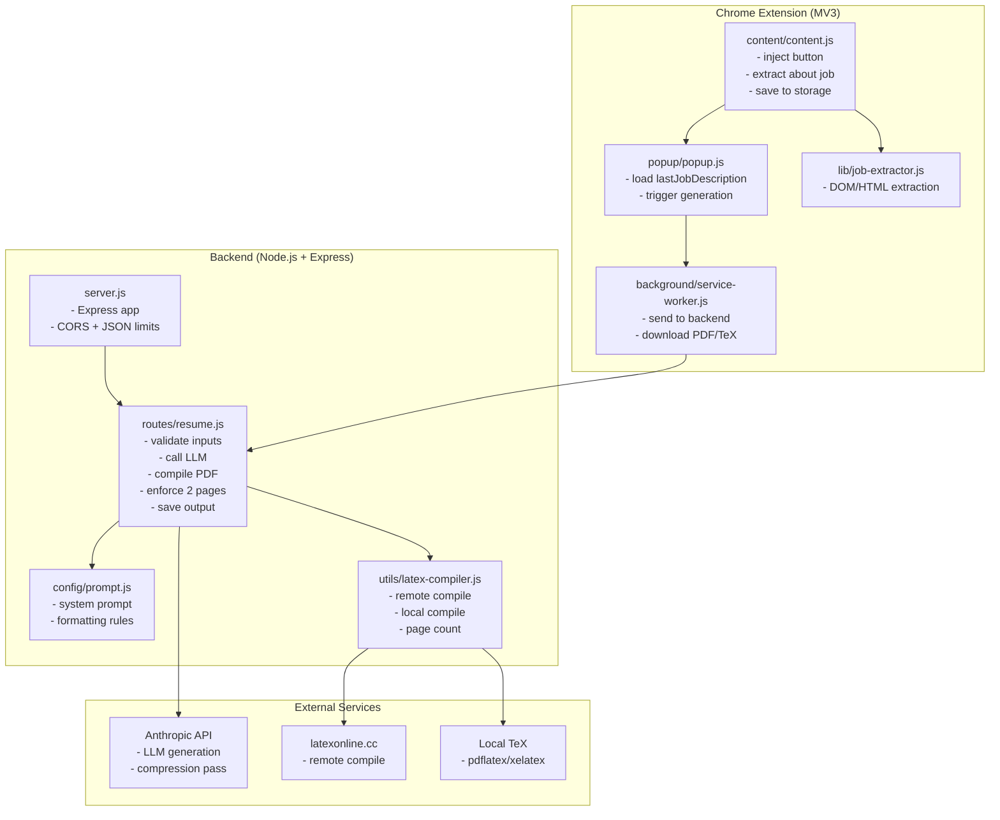
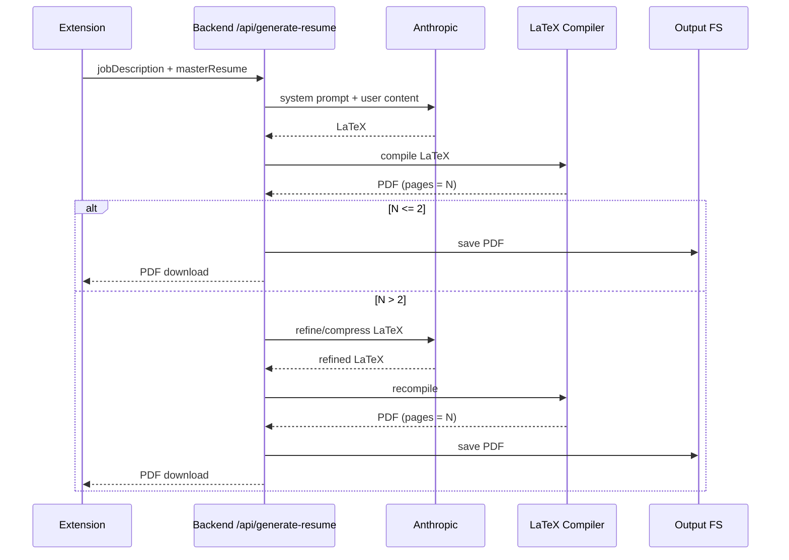
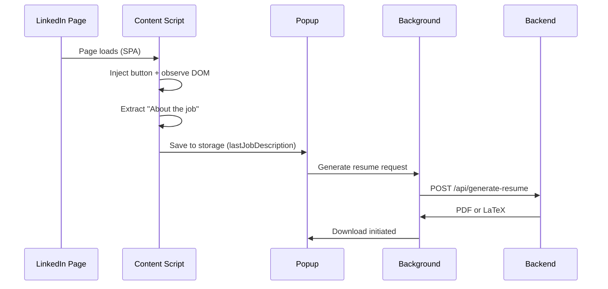
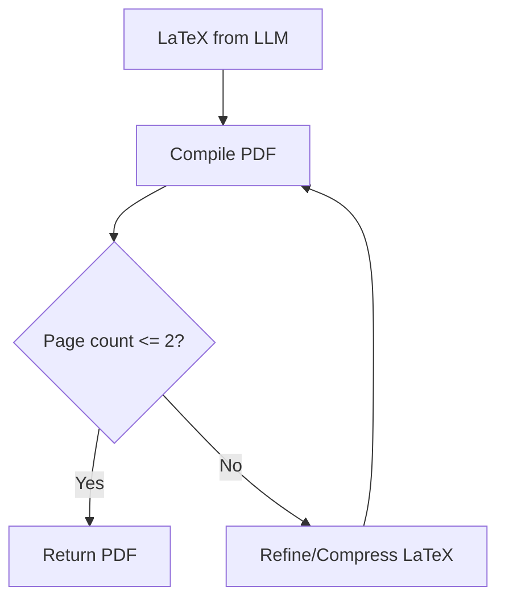

# Auto Resume Maker - Chrome Extension

AI-powered Chrome extension that generates ATS-optimized LaTeX resumes tailored to LinkedIn job postings. The system injects a button into LinkedIn job pages, extracts the “About the job” section, and uses a backend service to generate and compile a 2‑page resume PDF.

**Workspace layout**
```
/
  backend/                 Node.js API for LLM calls + LaTeX compilation
  extension/               Chrome Extension (Manifest V3)
  openrouter-agent/        Separate agent tooling (optional)
  Sample_Resume.tex        Example LaTeX resume
```

## Features
- LinkedIn page button injection for one‑click extraction.
- Robust job description extraction with multi‑selector fallbacks.
- 2‑page enforcement with post‑generation compression.
- LaTeX output compiled to PDF (remote with local fallback).
- Backend saves a copy of each generated PDF.

## Architecture

**High‑level flow**
```
LinkedIn Job Page
  └─ Content Script (button + extractor)
        └─ Extension Popup
              └─ Background Service Worker
                    └─ Backend API (Node/Express)
                          └─ Anthropic API
                                └─ LaTeX Compiler
                                      └─ PDF
```

**Mermaid diagram**


## Component Diagram (Detailed)



## Request/Response Schemas

**`POST /api/generate-resume`**

Request body:
```json
{
  "jobDescription": "string (min 50 chars)",
  "masterResume": "string (min 100 chars)"
}
```

Successful response:
```
Content-Type: application/pdf
Content-Disposition: attachment; filename="resume.pdf"
<binary PDF>
```

Fallback response when LaTeX compilation fails:
```json
{
  "success": true,
  "latex": "string",
  "compilationFailed": true,
  "error": "LaTeX compilation failed. Returning source code."
}
```

Error response:
```json
{
  "success": false,
  "error": "string"
}
```

## Internal Backend Flow (Detailed)



## Extension Details

**Core components**
- `extension/content/content.js`
  - Injects “Create Custom Resume” button.
  - Extracts “About the job” using the exact `data-sdui-component` container when present.
  - Falls back to `JobExtractor` heuristics.
  - Saves the extracted text to `chrome.storage.local` as `lastJobDescription`.
- `extension/lib/job-extractor.js`
  - Multi‑strategy extraction: heading match, LinkedIn job details, heuristic long‑text detection.
- `extension/popup/popup.js`
  - Loads `lastJobDescription` from storage.
  - Triggers resume generation via background worker.
- `extension/background/service-worker.js`
  - Sends requests to backend (preferred mode).
  - Handles PDF or `.tex` download responses.

**Popup and injection UX**


## Backend Details

**Primary endpoints**
- `GET /health` — health check
- `POST /api/generate-resume` — generate resume from job description + master resume

**Resume generation pipeline**
1. Validate job description and master resume.
2. Send combined prompt to Anthropic.
3. Extract LaTeX from response.
4. Compile LaTeX to PDF:
   - Remote `latexonline.cc` for small payloads.
   - Local `pdflatex` fallback for large payloads or when remote is disabled.
5. Enforce 2‑page limit:
   - Compile → count pages.
   - If >2 pages, refine and compress LaTeX once via Anthropic.
6. Save PDF to `backend/output/`.
7. Return PDF response to the extension.

**2‑page enforcement logic**


## Configuration

**Backend environment variables**
- `ANTHROPIC_API_KEY` (required)
- `PORT` (default `3000`)
- `LATEX_COMPILER` (`local` to force local compilation)
- `LATEX_ENGINE` (default `pdflatex`)
- `ANTHROPIC_TIMEOUT_MS` (default `120000`)

**Extension settings**
- Backend URL must be set in the extension options page.

## Setup

### Backend
```bash
cd backend
npm install
cp .env.example .env
# Add ANTHROPIC_API_KEY to .env
npm start
```

### Chrome Extension
1. Open `chrome://extensions/`
2. Enable Developer Mode
3. Load unpacked → select `extension/`
4. Open extension options and set backend URL (e.g., `http://localhost:3000`)

## Data Storage
- Extension: `chrome.storage.local.lastJobDescription`
- Backend: `backend/output/resume-<timestamp>.pdf`

## Security Notes
- API key is stored on the backend, not in the extension.
- The extension only extracts page content and sends it to the backend when you trigger generation.

## Troubleshooting
- If PDF compilation fails locally, ensure a TeX distribution is installed and `pdflatex` is on PATH.
- If the button doesn’t appear, confirm you are on a LinkedIn job page and the extension is enabled.
- If extraction fails, use the popup manual paste or “Load from HTML File” option.

## License
MIT
